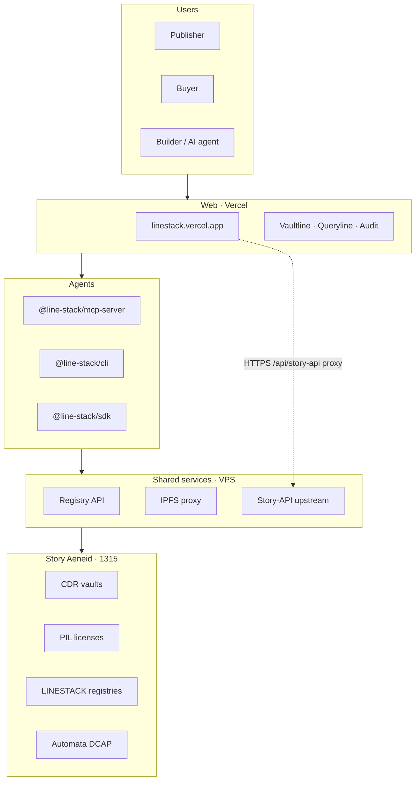
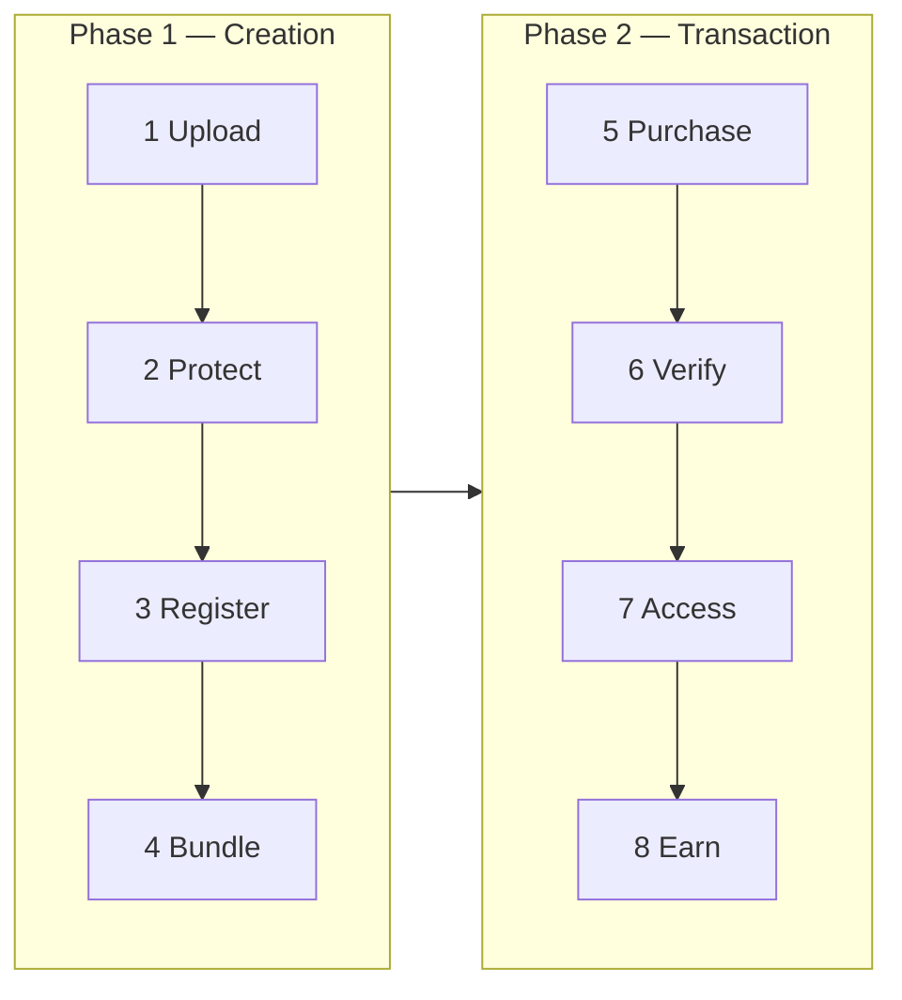
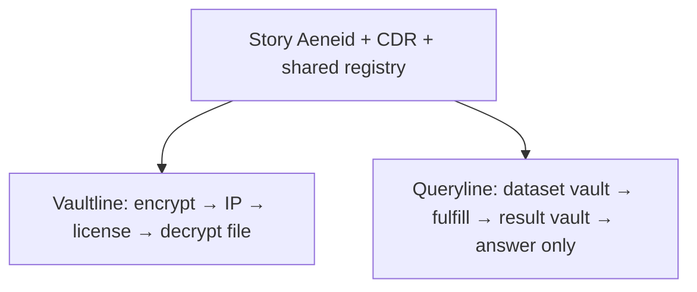
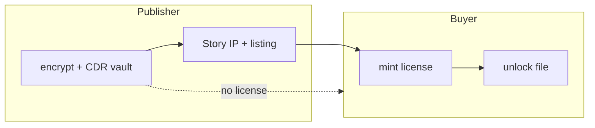
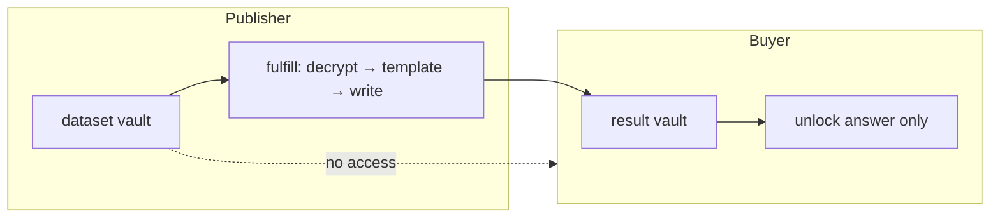

# Line Stack

**Confidential data marketplace on [Story](https://story.foundation) Aeneid (chain 1315)** — sell licensed private files and licensed answers. Real CDR vaults, Story PIL licenses, on-chain audit, and agent tooling. No mock txs.

| Product | For | What buyers get |
|---------|-----|-----------------|
| **Vaultline** | Creators, analysts, research teams | Pay → mint license → **decrypt the file** (reports, CSVs, packs) |
| **Queryline** | Data owners with sensitive datasets | Pay → request template → **unlock the answer only** (raw dataset never exposed) |

**Live app:** https://linestack.vercel.app  
**Architecture (visual):** https://linestack.vercel.app/architecture  
**Author:** [henrysammarfo](https://github.com/henrysammarfo)  
**Hackathon:** [CDR Hackathon](https://story.foundation) — form copy in [docs/HACKATHON-SUBMISSION.md](docs/HACKATHON-SUBMISSION.md)  
**Fresh E2E test:** [docs/FRESH-E2E-TEST.md](docs/FRESH-E2E-TEST.md) · **Why CDR:** [docs/CDR-WHY-IT-MATTERS.md](docs/CDR-WHY-IT-MATTERS.md)

---

## Problem → solution

| Problem | Line Stack solution |
|---------|---------------------|
| Valuable data shared via Drive links and DMs — no license, easy leak | **Vaultline:** encrypt into CDR vaults, register as Story IP, **pay-to-unlock** with PIL |
| Buyers must buy the whole dataset to get one insight | **Queryline:** **dataset vault** (publisher-only) + **result vault** (buyer gets answer only) |
| Every Story/CDR app rebuilds vaults, conditions, unlock, audit | **SDK, CLI, MCP** — same registry and txs as the web app |

**Who uses it:** **Publishers** monetize data · **Buyers** pay for access or answers · **Builders** embed the rails in new Story apps and agents.

**How value flows:** listing/query fees and licenses on Story testnet today; roadmap = marketplace take rate + hosted console for teams (see [docs/ARCHITECTURE.md](docs/ARCHITECTURE.md)).

---

## Architecture diagrams

**Visual (dark flow boxes):** https://linestack.vercel.app/architecture  
**Deep dive:** [docs/ARCHITECTURE.md](docs/ARCHITECTURE.md)

### Full stack



---

### Eight-step marketplace lifecycle



| Step | Vaultline | Queryline |
|------|-----------|-----------|
| 1–4 | File → CDR + IPFS → Story IP → listing | Dataset → templates |
| 5–8 | Buy license → verify → unlock file | Request → fulfill → unlock answer |

---

### Product split (shared CDR)



---

### Vaultline access model



**Try:** `/vaultline` → create vault → upload → register IP → listings → buy → unlock  

---

### Queryline access model (honest)



- Publisher-side fulfill until CDR `executeQuery`; **vault isolation is real**.  
- EIP-712 + Automata DCAP on fulfill.  

**Try:** `/queryline` → seed dataset → template → request → fulfill → unlock result  

Details: [docs/QUERYLINE.md](docs/QUERYLINE.md) · [docs/ATTESTATION.md](docs/ATTESTATION.md)

---

## Live stack

| Layer | Where |
|-------|--------|
| Web UI | [Vercel](docs/VERCEL-ENV.md) — `linestack.vercel.app` |
| Story-API (browser) | HTTPS proxy `/api/story-api` → VPS Story-API |
| IPFS + registry | Vultr VPS ([docs/IPFS-VPS.md](docs/IPFS-VPS.md), [docs/REGISTRY-VPS.md](docs/REGISTRY-VPS.md)) |
| Contracts | Dataset/template registries + conditions on Aeneid ([docs/CONTRACTS.md](docs/CONTRACTS.md), `contracts/deployed.aeneid.json`) |
| Attestation | EIP-712 fulfill binding + [Automata DCAP](docs/ATTESTATION.md) on Aeneid |

---

## Quick start (developers)

```bash
git clone https://github.com/henrysammarfo/linestack.git
cd linestack
cp .env.example .env.local   # fund wallet: https://faucet.story.foundation
npm install
npm run build:core
npm run dev                    # http://localhost:8080
```

**Checks:**

```bash
npm run hackathon:check
npm run test:beta-env
npm run setup:agents
```

**Two-wallet E2E:** publisher wallet + buyer wallet (incognito) on **Aeneid 1315** — [docs/BETA-ONBOARDING.md](docs/BETA-ONBOARDING.md)

**Agents (CLI / SDK / MCP):**

| Doc | Purpose |
|-----|---------|
| [docs/AGENT-INTEGRATIONS.md](docs/AGENT-INTEGRATIONS.md) | Cursor, Claude, ChatGPT, Gemini |
| [docs/SDK-CLI-MCP.md](docs/SDK-CLI-MCP.md) | Commands & MCP tools |
| [.linestack.env.example](.linestack.env.example) | `~/.linestack/.env` template |
| [AGENTS.md](AGENTS.md) | Short rules for coding agents |
| [docs/config/cursor-mcp.json](docs/config/cursor-mcp.json) | MCP config snippet |

---

## npm packages

| Package | Description |
|---------|-------------|
| [`@line-stack/cdr-core`](packages/cdr-core) | CDR + Aeneid + registry + attestation |
| [`@line-stack/sdk`](packages/sdk) | Node `LineStack` API |
| [`@line-stack/cli`](packages/cli) | `linestack` terminal |
| [`@line-stack/mcp-server`](packages/mcp-server) | 17 MCP tools (stdio) |

```bash
npm install -g @line-stack/cli @line-stack/mcp-server
```

Publish (maintainer): [docs/NPM-PUBLISH-COMMANDS.md](docs/NPM-PUBLISH-COMMANDS.md) · [docs/PUBLISHING.md](docs/PUBLISHING.md). **Never share npm tokens in chat.**

---

## Docs index

Full index: **[docs/README.md](docs/README.md)**

| Doc | Audience |
|-----|----------|
| [ARCHITECTURE.md](docs/ARCHITECTURE.md) | CDR + Story eight-step map + Queryline diagram |
| [QUERYLINE.md](docs/QUERYLINE.md) | What works today, two-wallet test |
| [HACKATHON-SUBMISSION.md](docs/HACKATHON-SUBMISSION.md) | Google form answers |
| [DISCORD-SUBMISSION.md](docs/DISCORD-SUBMISSION.md) | Discord post copy |
| [DEMO-VIDEO.md](docs/DEMO-VIDEO.md) | **2–3 min** video script |
| [HACKATHON.md](docs/HACKATHON.md) | Pre-record checklist |
| [BETA-ONBOARDING.md](docs/BETA-ONBOARDING.md) | Testers & devs |

---

## Security

- Never put `WALLET_PRIVATE_KEY` on Vercel or in `VITE_*` vars.
- See [SECURITY.md](SECURITY.md).

---

## License

MIT — see [LICENSE](LICENSE).
