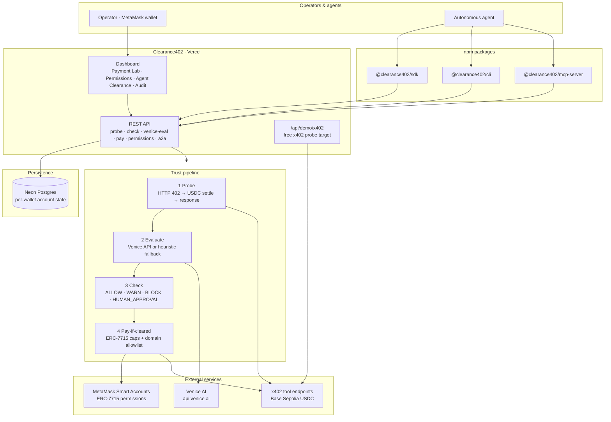
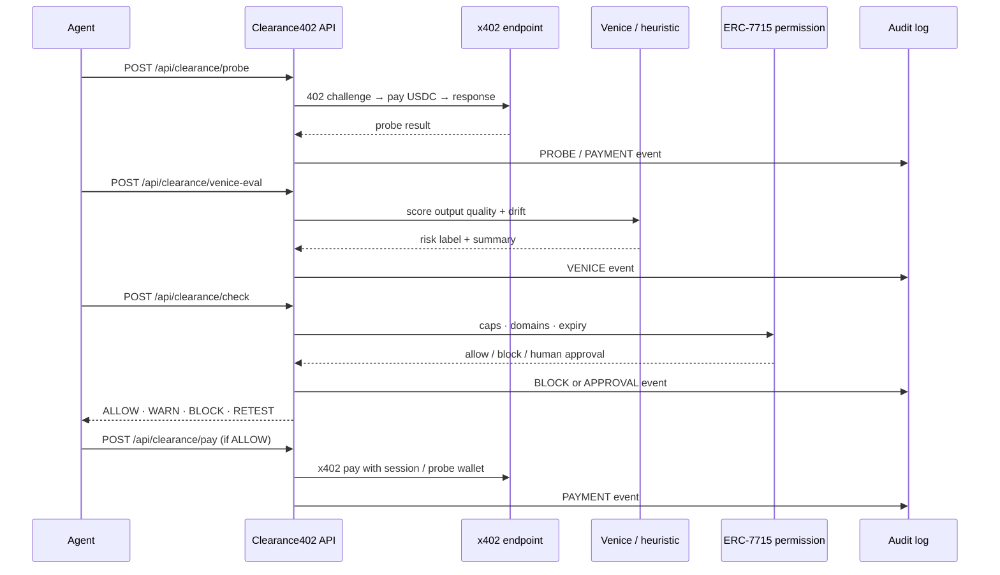

# Clearance402

**Before your agent pays, it gets clearance.**

Clearance402 is the trust, testing, onboarding, and safety layer for **x402 / MCP agent payments** on **Base Sepolia**. x402 lets agents pay — Clearance402 tells them what is *safe* to pay for.

**Live:** https://clearancex402.vercel.app · **Status:** https://clearancex402.vercel.app/api/clearance/status

Built for the [MetaMask Smart Accounts Kit × 1Shot × Venice AI Dev Cook Off](https://hackquest.io/hackathons/MetaMask-Smart-Accounts-Kit-x-1Shot-API-x-Venice-AI-Dev-Cook-Off).

---

## Architecture



### Clearance decision flow



| Layer | Technology | Role |
|-------|------------|------|
| **Web** | Vercel + TanStack Start | Operator console, wallet-scoped UI |
| **API** | Node server routes | Probe, check, eval, pay, permissions, audit |
| **Agents** | SDK, CLI, MCP | Same flows as UI — judges run `npx` without clone |
| **Payments** | `@x402/fetch` + x402.org facilitator | Real Base Sepolia USDC settlement |
| **Permissions** | MetaMask Smart Accounts Kit | ERC-7715 spend caps, domain allowlists |
| **Eval** | Venice REST API | Output scoring; heuristic when credits exhausted |
| **Storage** | Neon Postgres on Vercel | Per-wallet probes, permissions, audit, sessions |

---

## Quick start

```bash
cp .env.example .env.local   # WALLET_PRIVATE_KEY + optional VENICE_API_KEY
npm install
npm run dev                  # http://localhost:8080
```

Connect MetaMask on **Base Sepolia (84532)**. Fund the **session buyer EOA** (shown on `/permissions`) with ETH + test USDC ([Circle faucet](https://faucet.circle.com/)).

### npm (no clone required)

```bash
npx -y @clearance402/cli status
npx -y @clearance402/cli tools list
npx -y @clearance402/mcp-server
```

| Package | Install |
|---------|---------|
| `@clearance402/sdk` | `npm i @clearance402/sdk` |
| `@clearance402/cli` | `npm i -g @clearance402/cli` |
| `@clearance402/mcp-server` | `npx -y @clearance402/mcp-server` |

---

## Environment

| Variable | Purpose |
|----------|---------|
| `VITE_BASE_SEPOLIA_RPC_URL` | Browser RPC (default: `https://sepolia.base.org`) |
| `VITE_CLEARANCE_CHAIN_ID` | `84532` |
| `VITE_WALLETCONNECT_PROJECT_ID` | WalletConnect modal |
| `DATABASE_URL` | Neon Postgres (production persistence) |
| `WALLET_PRIVATE_KEY` | **Server only** — probe / demo x402 buyer |
| `VENICE_API_KEY` | **Server only** — output eval (heuristic fallback if unset) |
| `CLEARANCE402_API_URL` | SDK / CLI / MCP target (default: production URL) |
| `CLEARANCE402_WALLET` | Wallet header for multi-tenant API calls |

---

## Demo flow (3 min)

1. **Payment Lab** — Live x402 probe on built-in demo (`x402-sepolia-demo` → `/api/demo/x402`)
2. **Venice eval** — Output quality + drift scoring (or heuristic fallback)
3. **Permissions** — Grant buyer-agent spend cap via MetaMask (ERC-7715-style)
4. **Agent clearance** — `Check` → `ALLOW` / `BLOCK` before payment
5. **Pay if cleared** — Server-side x402 when mandate + clearance pass
6. **A2A lab** — Scout → Verifier → Guardian → Buyer redelegation
7. **Audit** — Probe, payment, permission, Venice, and block events

Smoke test: `node scripts/smoke-clearance402.mjs https://clearancex402.vercel.app`

---

## API routes

| Route | Purpose |
|-------|---------|
| `GET /api/clearance/status` | Health + env flags |
| `GET /api/clearance/account` | Wallet-scoped store snapshot |
| `POST /api/clearance/probe` | Live x402 probe |
| `POST /api/clearance/venice-eval` | Venice output eval |
| `POST /api/clearance/check` | Agent clearance decision |
| `POST /api/clearance/pay` | Pay-if-cleared (server-side x402) |
| `GET/POST/DELETE /api/clearance/permissions` | Spend mandates |
| `POST/GET /api/clearance/session` | Encrypted agent session keys |
| `POST /api/clearance/a2a` | Multi-agent coordination |
| `GET /api/clearance/audit` | Audit log |
| `GET /api/demo/x402` | Free x402 probe target for judges |

---

## MCP

```bash
npm run build:mcp
CLEARANCE402_API_URL=https://clearancex402.vercel.app npm run mcp
```

Nine tools including `clearance402_status`, `clearance402_probe_endpoint`, `clearance402_check_payment`, `clearance402_pay_if_cleared`, `clearance402_get_audit_log`. See [AGENTS.md](./AGENTS.md) and [packages/clearance402-mcp/README.md](./packages/clearance402-mcp/README.md).

---

## Hackathon tracks

| Track | How Clearance402 qualifies |
|-------|---------------------------|
| **x402 + ERC-7710** | Live Base Sepolia probes + ERC-7715 permission gates before pay |
| **Best Agent** | SDK, CLI, MCP — agents check clearance before spending |
| **A2A** | Scout / Verifier / Guardian / Buyer coordination lab |
| **Venice AI** | Output eval via Venice API + heuristic fallback for demos |
| **Social / Feedback** | Structured partner feedback below |

**Note:** 1Shot Relayer prize requires **mainnet** — this build targets **Base Sepolia testnet only**.

---

## Feedback track

We are submitting feedback for the **Social / Feedback** prize. Below is honest, actionable input from building Clearance402 end-to-end on Base Sepolia.

### MetaMask Smart Accounts Kit

- Ship a minimal **Base Sepolia** reference repo: permission grant → x402 pay → revoke in one flow.
- Clarify when to use `@metamask/delegation-toolkit` vs `@metamask/smart-accounts-kit` (deprecation notice was easy to miss during the cook-off).

### x402 on Base Sepolia

- A cook-off **setup checklist** (Circle USDC faucet + probe `WALLET_PRIVATE_KEY`) would save hours for first-time builders.
- Link x402.org facilitator docs from HackQuest resources — the facilitator itself worked well once funded.

### Venice AI

- Venice's **x402 payment path targets Base mainnet**; for Sepolia demos we used the REST API with `VENICE_API_KEY` and a local heuristic when credits ran out. Document this split explicitly.
- Recommend model IDs that return **structured JSON** for eval / risk-scoring use cases.

### 1Shot

- Prize rules require **mainnet** relayer — consider a testnet-only alternate track or a clearer callout for builders without mainnet budget.

### HackQuest

- Workshop recording links in the Resources tab would help late joiners (submission window was tight).

### What would help the next team

> A single **"agent pay-if-cleared"** reference implementation tying x402 + ERC-7715 + audit in one repo would accelerate future hackathon teams.

Full notes: [notes/feedback.md](./notes/feedback.md) · Submission copy: [docs/HACKATHON-SUBMISSION.md](./docs/HACKATHON-SUBMISSION.md)

---

## Project structure

```
src/
  routes/              Console + API routes
  lib/clearance/       probe, check, venice, store, x402, permissions
packages/
  clearance402-sdk/    API client
  clearance402-cli/    clearance402 CLI
  clearance402-mcp/      MCP server for agent hosts
docs/
  HACKATHON-SUBMISSION.md
  MEDIA-PRODUCTION.md
  GAMMA-PITCH.md
public/media/
  architecture.svg     deck graphic (companion to mermaid above)
```

---

## Links

| Resource | URL |
|----------|-----|
| Live app | https://clearancex402.vercel.app |
| GitHub | https://github.com/henrysammarfo/clearancex402 |
| MCP page | https://clearancex402.vercel.app/mcp |
| Free x402 demo | https://clearancex402.vercel.app/api/demo/x402 |
