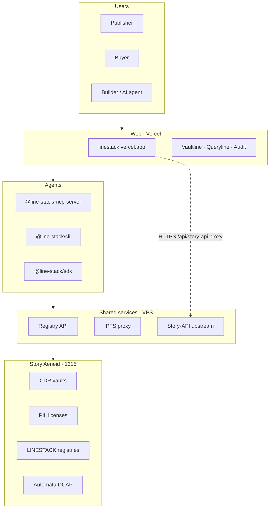
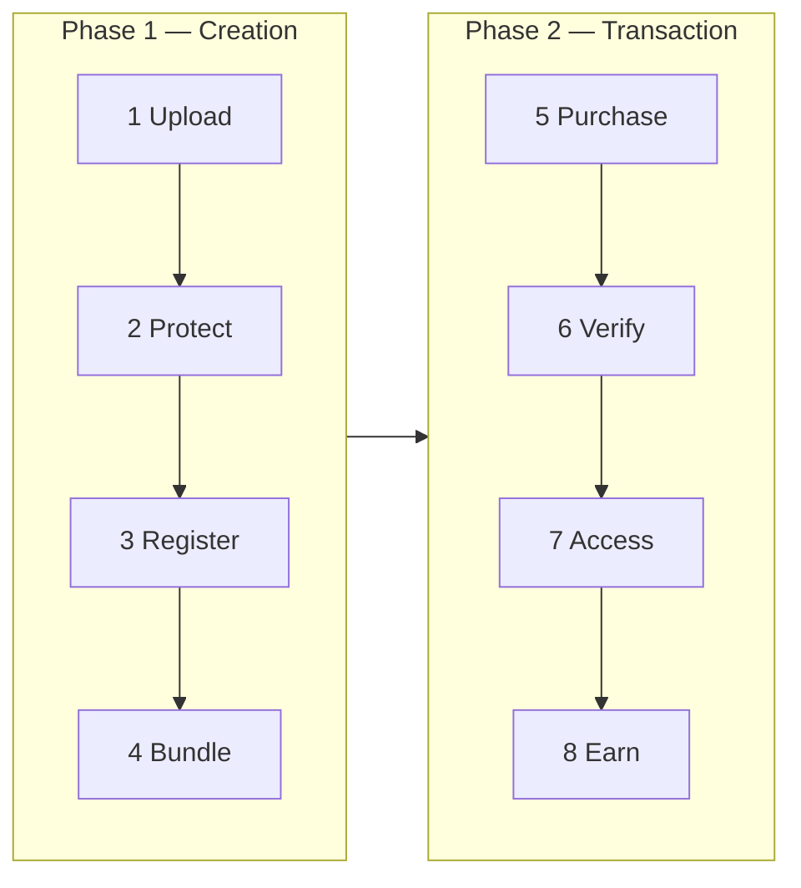
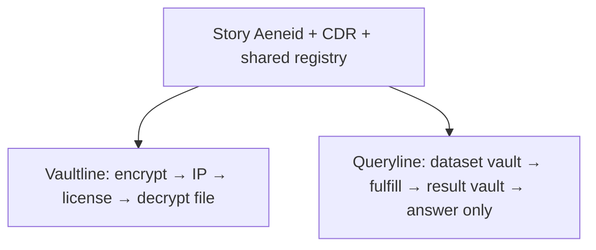
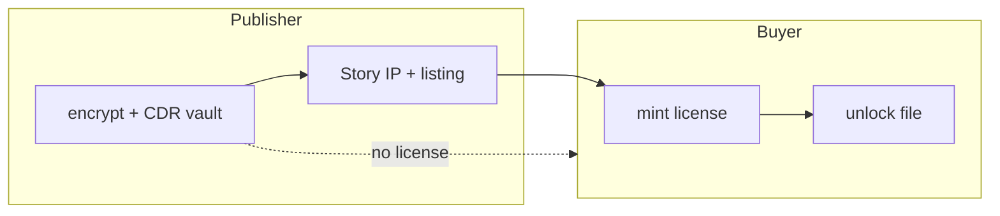
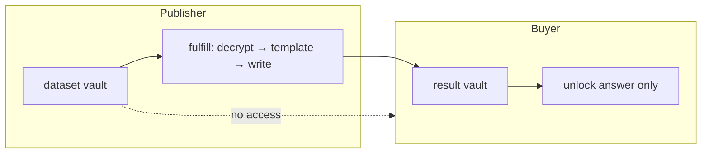

# Architecture — Turn Data into Programmable IP

Line Stack implements the **CDR + Story marketplace** model: private data becomes **on-chain programmable IP** with **conditional access**, not a one-time black-box sale.

**Visual:** https://linestack.vercel.app/architecture  
**Live app:** https://linestack.vercel.app

---

## Status Quo vs New Model

| Status Quo | New Model (Line Stack + CDR + Story) |
|------------|-------------------------------------|
| One-time payment | **Recurring income** — licenses, queries, listings |
| Loss of control | **Contributor ownership** — you hold keys & IP registration |
| Black box | **Auditable proof** — Story tx hashes, audit log, EIP-712 + Automata on fulfill |

---

## Eight-step mapping (reference diagram)

| Step | CDR / Story concept | Line Stack implementation |
|------|---------------------|---------------------------|
| **1. Upload** | Contributor adds voice, video, text | **Vaultline:** `upload-file` · **Queryline:** `create-dataset` + `seed` rows |
| **2. Protect** | Encrypt + secure off-chain storage | **CDR** allocate/write + **VPS IPFS** / Storacha pin |
| **3. Register** | Story **IP Asset** (on-chain deed) | **Vaultline:** `register-ip` → IPA + `licenseTermsId` |
| **4. Bundle** | Compose **datasets** (derivative IP) | **Queryline:** dataset vault + **allow-listed templates** · **Vaultline:** vault + listing |
| **5. Purchase** | Buyer pays (currency / token) | **Vaultline:** `buy-license` (WIP) · **Queryline:** `request-query` (result vault allocated) |
| **6. Verify** | License token + TEE validators choreograph | **CDR conditions** at decrypt · Story license mint · **Automata** `verifyAndAttestOnChain` on fulfill |
| **7. Access** | Conditional decryption, partial keys | **Vaultline:** `unlock-file` · **Queryline:** publisher `fulfill` → buyer `unlock-result` (dataset vault never exposed) |
| **8. Earn** | Royalties to contributors | **Story PIL** terms + listing price · audit rows with revenue-related txs |

---

## Full stack

**Visual:** https://linestack.vercel.app/architecture (dark box diagrams)

| Layer | Technology | Role |
|-------|------------|------|
| **Web** | Vercel + TanStack | Vaultline / Queryline UI, audit, attestation display |
| **Agents** | `@line-stack/mcp-server`, CLI, SDK | Same flows as UI (shared registry) |
| **Registry** | VPS JSON API | Listings, datasets, requests (shared marketplace state) |
| **Storage** | IPFS proxy + Storacha | Encrypted blobs off-chain |
| **Crypto** | `@piplabs/cdr-sdk` | Vaults, read/write conditions, decrypt |
| **IP** | Story Protocol SDK | Register IP, mint licenses, PIL terms |
| **Contracts** | `LINESTACK_*` on Aeneid | Dataset/template registry, custom conditions |
| **Attestation** | Automata DCAP + EIP-712 | Verifiable fulfill binding (Queryline) |

---

## Eight-step lifecycle

---

## Product split

---

## Vaultline access model

---

## Queryline access model (honest)

- **6. Verify / 7. Access:** CDR enforces **who** can decrypt **which vault**.
- Template execution is **publisher-side** until Story ships enclave `executeQuery` in the SDK.
- **Automata** adds on-chain proof that fulfill attestation ran (see `docs/ATTESTATION.md`).

---

## Agent + human actors

| Actor | Interfaces |
|-------|------------|
| Contributor / publisher | Web, CLI, MCP |
| Buyer | Web, CLI, MCP (second wallet) |
| Validator / TEE narrative | Automata on-chain DCAP (Intel quote verified on Aeneid) |

**A2A negotiate protocol:** not implemented — agents use MCP tools directly ([A2A.md](./A2A.md)).

---

## Related

- [QUERYLINE.md](./QUERYLINE.md) · [ATTESTATION.md](./ATTESTATION.md) · [CONTRACTS.md](./CONTRACTS.md)
- [HACKATHON-SUBMISSION.md](./HACKATHON-SUBMISSION.md) — paste “how we use CDR” from step table above
